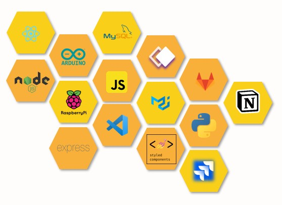
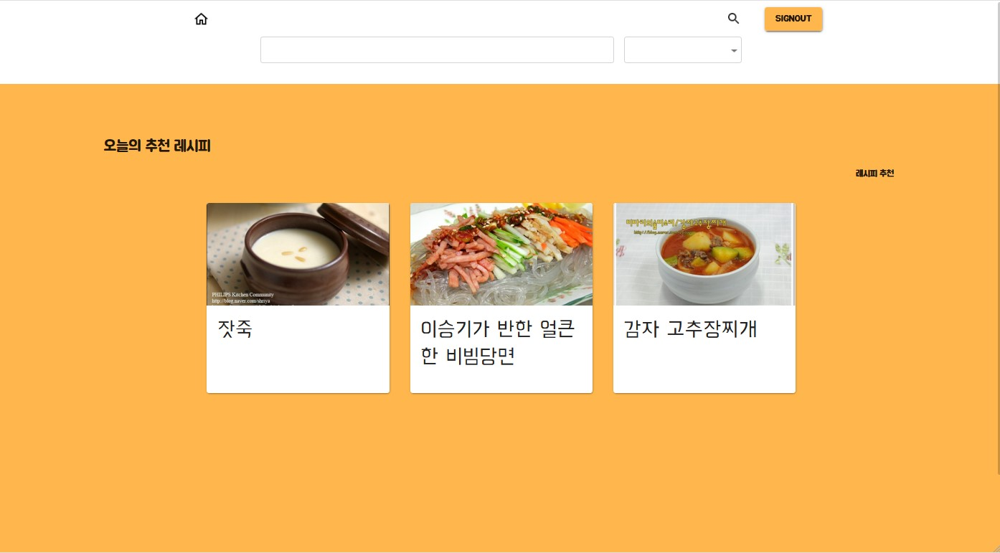
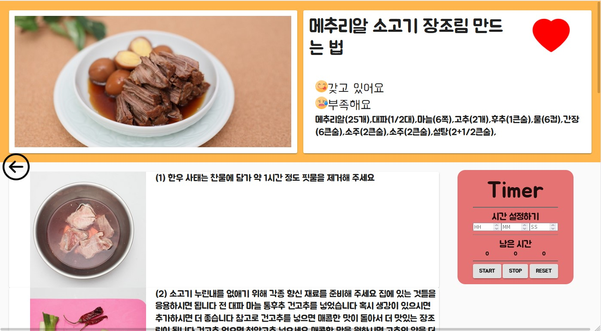

# 🍏 냉장고를 부탁해 🍎

---

#### SSAFY 우수 프로젝트 선정

차성민, 엄재식, 진지연, 박민상, 윤소영

## 01. 목표

- IoT, AI, Node.js 등 다양한 기술을 경험해보자
- IoT 터치 패널로 냉장고를 관리하고, 갖고 있는 재료에 적합한 레시피를 추천해주는 서비스를 만들자

## 02. 팀 소개

- 프론트 : 차성민(팀장), 엄재식(프론트)
- 백엔드 : 진지연(추천 알고리즘, IoT), 박민상(서비스 로직), 윤소영(로그인, IoT)
- 팀 룰
  - Notion, Jira, GitLab, Discord을 활용해서 커뮤니케이션의 오류를 줄이자

## 03. 추천 알고리즘

- 갖고 있는 재료에 적합한 레시피를 추천해준다

## 04. IoT 활용

- IoT 터치 패널로 냉장고에 재료를 추가할 수 있다.
- IoT 센서를 활용해서 요리할 때 유용한 기능 타이머, 유통기한 임박 알림을 이용할 수 있다.

### 

## 05. 아키텍쳐

#### 추천 알고리즘

- 백엔드 서버로 두 개를 활용했다. 추천 알고리즘은 Django로, 서비스 로직과 IoT 제어는 Node.js로 구현했다. 
- 브라우저 - Nodejs - Django 구조로 구현했는데 장단점은 다음과 같다.
  - 장점 ) 로그인 기능을 Nodejs 에서만 구현하면 된다. DB에 동시접근 할 우려가 없다
  - 단점 ) Nodejs와 Django 가 통신하는 과정에서 브라우저를 거치지 않기 때문에 JWT 토큰이 유실된다. 그래서 통신할 때에 JWT 토큰을 넣어줘야 했다.

#### IoT

- 서버가 어떻게 IoT 센서를 제어하는지 연구했다.
- 웹과 통신하는 기능이 없으므로, 클라우드가 아닌 라즈베리파이 로컬 환경에 서버를 구성하고 IoT 센서와 소통하도록 했다.