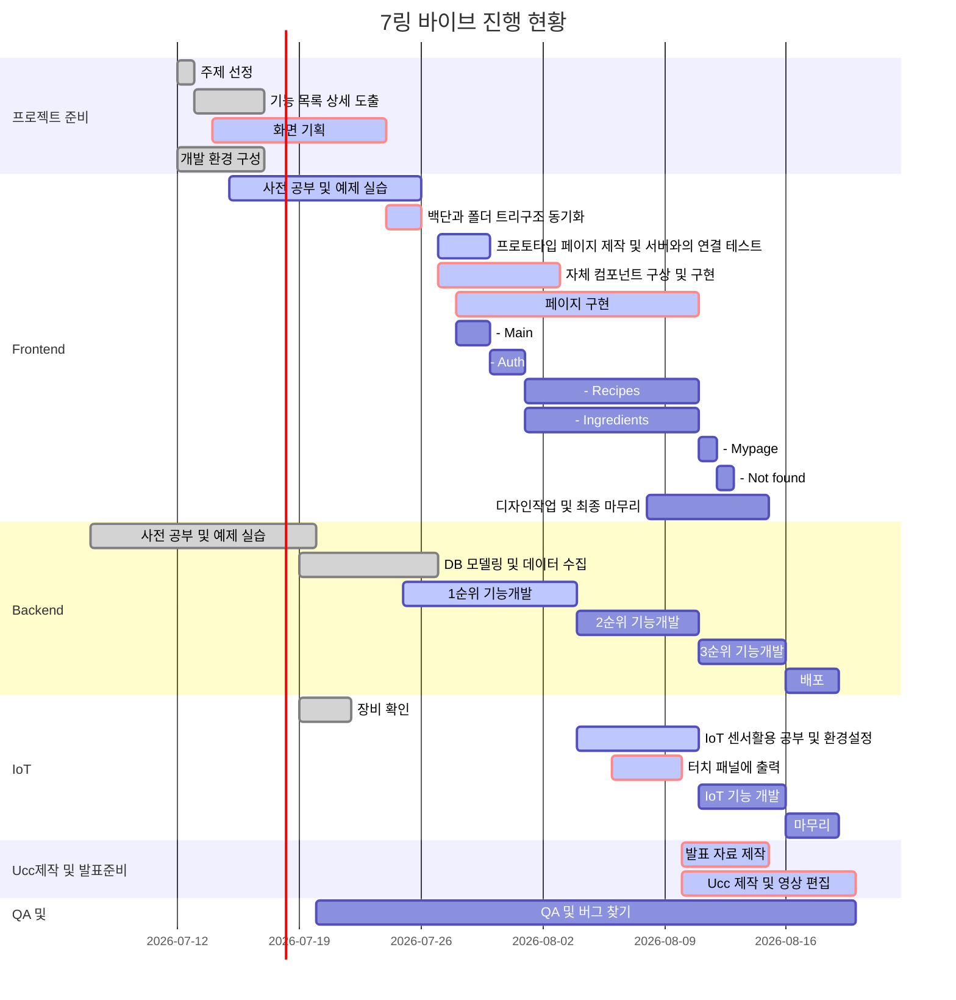

# 프로젝트 명

---

## :bulb: 목차

- [프로젝트 소개](#프로젝트-소개)   
- [텍스트 ... ](#프로젝트-소개)   
- [프로젝트 명세](#프로젝트-명세)
  - [배포 환경](#배포-환경)
  - [개발 환경](#개발-환경)
  - [Design Resources](#design-resources)
  - [핵심 라이브러리](#핵심-라이브러리)
  - [Ganttchart](#Gantt-Chart)
  - [진행과정](#진행과정)

 

 

## :book: 프로젝트 소개

#### 2030 1인가구를 위한 냉장고 관리 서비스

- 팀명: 7링바이브
- 트랙 : IoT

### :soccer: 목표

점점 늘어가는 2030 1인가구를 위한 냉장고 매니저이고, 2030 1인가구들의 입장에서 냉장고를 보다 효율적으로 활용할 수 있게 서비스를 제공하고자 함.
 

#### :boy: 우리의 페르소나

- 요리에 관심이 있고 레시피 추천이 필요한 사람
- 요리에 관심이 있지만 재료관리를 잘 못하는 사람
- 요리에 크게 관심이 없어 냉동 식품을 쌓아두고 먹는 사람

 여러 케이스의 사람들을 모두 만족시켜주기 위한 기능들을 구현하고, 작성한 목업에 따라 웹페이지를 완성한 후, 이를 라즈베리파이의 터치스크린을 통하여 보여주는 흐름을 구상하였습니다.

---

#### :envelope_with_arrow: 활용기술스택

React, Node.js, Django, DB(Mysql), 아두이노, 라즈베리파이, Whimsical, Python, Vanilla JS, vsCode, Chrome Browser, 센서 등 다양한 툴을 사용하고 있으며, 체계적인 프로젝트를 위해 Jira, Notion, GitLab등의 협업툴을 활용했습니다.

#### :classical_building: ERD

### :triangular_ruler: 시퀀스 다이어그램

---

## :notebook_with_decorative_cover: 프로젝트 명세

### :airplane: 배포 환경

- __URL__ : 
- __배포 여부__ : O / X
- __접속 가능__ : 접속 가능 / 수정 중
- __HTTPS 적용__ : O / X
- __PORT__ : // 3rd Party에서 사용하는 포트가 있다면 기입해주세요. <- 기입 후 해당 주석 삭제
   

### :house: 개발 환경

#### Front-end [Link](https://lab.ssafy.com/s05-webmobile3-sub3/S05P13B107/-/blob/master/frontend/README.md)

- __Framework__ : React  (Ver : 4.0.3)
- __지원 환경__ : Web / IoT(라즈베리 파이)
- __담당자__ : 차성민, 엄재식
   

#### Back-end [Link](https://lab.ssafy.com/s05-webmobile3-sub3/S05P13B107/-/tree/master/backend)

- __Framework__ : Node.js, Express / Django
- __Database__ : Mysql
- __담당자__ : 박민상, 윤소영, 진지연
   

#### Design

- Material-UI 및 Bootstrap 활용
- __담당자__ : 차성민, 엄재식
   

__자체 제작 산출물__ (필요시 이미지 또는 설명 첨부)

- LOGO
- CardView
- Button
- Calendar
   

### :orange_book: 핵심 라이브러리

기본 제공하는 라이브러리 외 핵심 기능 구현에 사용한 라이브러리가 있다면 작성해주세요.   
예시 ) VR/AR 라이브러리, 애니메이션 라이브러리, 텍스트/사진/동영상 지원, 편집 라이브러리 등

- __Material - UI __
  - __링크__ : https://developers.google.com/ar
  - __소개__ : 
  - __사용 기능__ : 디자인 컴포넌트 제공
  - __담당자__ : 차성민, 엄재식
- __Bootstrap __
  - __링크__ : https://developers.google.com/ar
  - __소개__ : 
  - __사용 기능__ : 디자인 컴포넌트 제공
  - __담당자__ : 차성민, 엄재식

## :chart_with_upwards_trend: Gantt Chart 

## :package: 진행과정

### B107팀 2주차 정리

기획) 

- 1주차 내용 기반 와이어프레임 작성
- 자체 회의 피드백 내용들과 팀미팅 피드백 내용 관련 와이어 프레임 수정
- IoT 활용 기능 적용 및 세부 항목 개선 후 와이어 프레임 수정
- 주제, 개요, 기술스택, 단계별 목표 총정리
- 화면정의서 작성

프론트)

- 폴더 트리 설계
- 기본 페이지 구현 (Auth, Main, Ingredients, Recipes, Mypage, NotFound)
- 컴포넌트 구현 (Ingredients, Recipes)
- 반응형 컴포넌트 로직 생성 (ResponsiveSign, ResponsiveDialog)
- 리액트 useContext, useEffect, react-router-dom 추가 조사 및 공부

백엔드)

- AWS EC2 테스트 성공 확인
- 데이터 전처리 체크 후 크롤링 진행
- 크롤링 완료 후 DB저장하고 중복데이터 걸러내는 중
- 유저 CRUD 구현, 로그인 부분 구현 진행 중
- 검색 로직 구현 진행 중
- 추천로직 조사 중

기타)

- 자체 친목도모 시간 가짐 [Skribbl](https://skribbl.io/)
- Jira 환경 설정 및 틀잡기
- 개별 Jira 요구 스토리 포인트 모두 충족
- 전체적인 현황 파악을 위해 주 2회 테크리더와 팀장간 회의 진행

