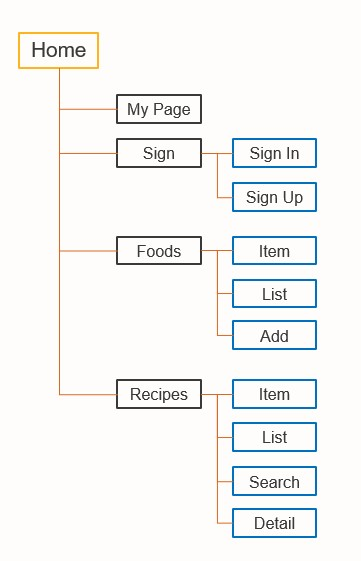

# :facepunch: Frontend

---

## :bulb:목차

- [소개](#소개)
- [목표](#목표)
- [트리구조](트리구조)

 

 

### :wave: 소개

- __Framework__ : React  (Ver : 4.0.3)
- **Design** : material-ui, React-Bootstrap
- __지원 환경__ : Web / IoT(라즈베리 파이)
- __담당자__ : 차성민, 엄재식

---

### :soccer: 목표

React의 장점을 활용하여 재사용성이 높고 체계적인 구조

사용자 편의를 고려하여 깔끔하고 간편한 UI/UX

---

### :deciduous_tree: 트리구조

---

